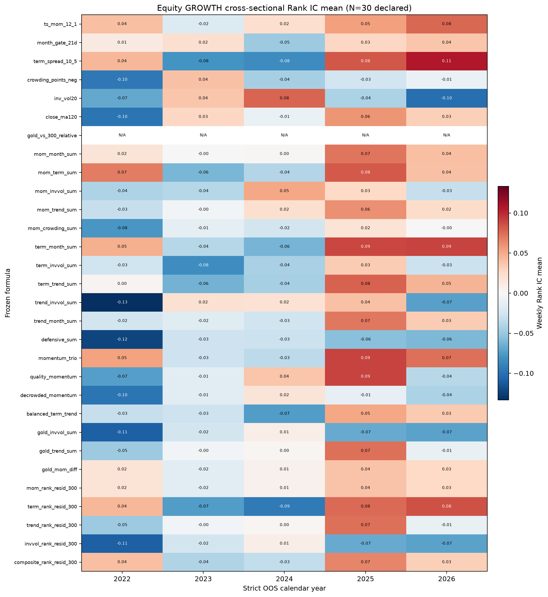

# Autonomous seed-composition factor evolution

Generated by `research/factor_evolve.py` at 2026-08-22 04:48 UTC.

## Frozen anti-overfit protocol

- Split-adjusted free ETF bars are loaded through `research/etf_panel.py`.
- The seven literature seeds and all N=30 formulas were declared before evaluation. Evolution is limited to sums, differences, causal expanding ranks, and rank residuals versus 510300; there is no OOS formula search.
- The 2018-2021 interval is the frozen design/training window. Only 2022-2026 is reported as OOS.
- Promotion uses 2022-2025 OOS only. 2026, including July, is a final stress/reporting slice and cannot create a candidate.
- Main evidence is weekly equity-only `GROWTH` cross-sectional Spearman Rank IC against strict next-week returns. Confirmation is per-name time-series IC on `510300.SS`, `159915.SZ`, `513100.SS`, `518880.SS`.
- Promotion requires prior-OOS main IR > 0.30, four-asset IR > 0.30, and positive N=30 deflated scores in both tests. At most 4 formulas may be recommended. Thresholds and signs are never relaxed.

The deflated score subtracts the expected best null IC IR across 30 independent Gaussian trials. Bonferroni p-values are also reported. The four-asset test has only four names, so passing its deflated hurdle is intentionally difficult.

## Promotion result

No formula passes every promotion gate; there is no mined live factor.

Frozen training rows: 3001; last training label: 2021-12-31.

## Promotion evidence: prior OOS 2022-2025

| Formula | CS weeks | CS mean | CS IR | CS deflated | CS Bonf p | Confirm names | Confirm mean | Confirm IR | Confirm deflated | Promote |
| --- | --- | --- | --- | --- | --- | --- | --- | --- | --- | --- |
| mom_month_sum | 199 | 0.023 | 0.072 | -0.075 | 1.0000 | 4 | 0.053 | 1.285 | 0.248 | no |
| momentum_trio | 199 | 0.022 | 0.065 | -0.082 | 1.0000 | 4 | 0.053 | 1.182 | 0.146 | no |
| ts_mom_12_1 | 199 | 0.025 | 0.063 | -0.084 | 1.0000 | 4 | 0.044 | 1.224 | 0.188 | no |
| mom_term_sum | 199 | 0.014 | 0.039 | -0.108 | 1.0000 | 4 | 0.044 | 2.598 | 1.561 | no |
| quality_momentum | 199 | 0.012 | 0.038 | -0.109 | 1.0000 | 4 | 0.032 | 1.073 | 0.036 | no |
| mom_trend_sum | 199 | 0.013 | 0.037 | -0.110 | 1.0000 | 4 | 0.032 | 1.706 | 0.669 | no |
| gold_mom_diff | 199 | 0.012 | 0.035 | -0.112 | 1.0000 | 4 | 0.046 | 0.825 | -0.212 | no |
| mom_rank_resid_300 | 199 | 0.012 | 0.035 | -0.112 | 1.0000 | 3 | -0.091 | -1.890 | -3.087 | no |
| term_month_sum | 199 | 0.010 | 0.029 | -0.118 | 1.0000 | 4 | 0.044 | 0.710 | -0.327 | no |
| composite_rank_resid_300 | 199 | 0.009 | 0.026 | -0.121 | 1.0000 | 4 | -0.045 | -0.633 | -1.670 | no |
| gold_trend_sum | 199 | 0.008 | 0.021 | -0.126 | 1.0000 | 4 | 0.012 | 0.143 | -0.894 | no |
| trend_rank_resid_300 | 199 | 0.008 | 0.021 | -0.126 | 1.0000 | 3 | -0.030 | -0.440 | -1.637 | no |
| month_gate_21d | 179 | 0.006 | 0.017 | -0.138 | 1.0000 | 4 | 0.043 | 0.599 | -0.437 | no |
| trend_month_sum | 199 | 0.002 | 0.006 | -0.141 | 1.0000 | 4 | 0.032 | 0.448 | -0.588 | no |
| mom_invvol_sum | 199 | 0.001 | 0.002 | -0.145 | 1.0000 | 4 | 0.030 | 0.487 | -0.550 | no |
| inv_vol20 | 199 | 0.001 | 0.002 | -0.145 | 1.0000 | 4 | 0.006 | 0.074 | -0.962 | no |
| close_ma120 | 199 | -0.003 | -0.008 | -0.155 | 1.0000 | 4 | -0.018 | -0.338 | -1.375 | no |
| term_trend_sum | 199 | -0.004 | -0.012 | -0.159 | 1.0000 | 4 | 0.030 | 0.612 | -0.425 | no |
| term_spread_10_5 | 199 | -0.008 | -0.019 | -0.166 | 1.0000 | 4 | 0.037 | 0.625 | -0.412 | no |
| term_rank_resid_300 | 199 | -0.011 | -0.028 | -0.175 | 1.0000 | 3 | 0.014 | 0.164 | -1.033 | no |
| trend_invvol_sum | 199 | -0.012 | -0.036 | -0.183 | 1.0000 | 4 | 0.015 | 0.353 | -0.684 | no |
| balanced_term_trend | 199 | -0.019 | -0.060 | -0.207 | 1.0000 | 4 | 0.052 | 6.649 | 5.613 | no |
| mom_crowding_sum | 199 | -0.023 | -0.077 | -0.224 | 1.0000 | 4 | 0.067 | 0.847 | -0.189 | no |
| term_invvol_sum | 199 | -0.028 | -0.082 | -0.229 | 1.0000 | 4 | 0.023 | 0.378 | -0.659 | no |
| decrowded_momentum | 199 | -0.025 | -0.084 | -0.231 | 1.0000 | 4 | 0.055 | 0.590 | -0.446 | no |
| crowding_points_neg | 195 | -0.031 | -0.103 | -0.251 | 1.0000 | 4 | 0.051 | 0.495 | -0.542 | no |
| gold_invvol_sum | 199 | -0.048 | -0.130 | -0.277 | 1.0000 | 4 | -0.013 | -0.257 | -1.294 | no |
| invvol_rank_resid_300 | 199 | -0.048 | -0.130 | -0.277 | 1.0000 | 3 | 0.055 | 0.586 | -0.611 | no |
| defensive_sum | 199 | -0.058 | -0.169 | -0.316 | 0.5128 | 4 | 0.041 | 0.427 | -0.610 | no |
| gold_vs_300_relative | 0 | N/A | N/A | N/A | N/A | 4 | -0.018 | -0.249 | -1.286 | no |

## Full OOS diagnostic: 2022-2026

These numbers are diagnostics only; 2026 never changes promotion.

| Formula | CS mean | CS IR | CS hit | 4-asset mean | 4-asset IR |
| --- | --- | --- | --- | --- | --- |
| momentum_trio | 0.028 | 0.083 | 53.7% | 0.058 | 2.485 |
| ts_mom_12_1 | 0.032 | 0.078 | 50.7% | 0.012 | 0.776 |
| mom_month_sum | 0.026 | 0.074 | 55.0% | 0.052 | 2.473 |
| term_month_sum | 0.021 | 0.058 | 52.4% | 0.056 | 1.876 |
| mom_term_sum | 0.017 | 0.048 | 49.8% | 0.043 | 2.377 |
| mom_trend_sum | 0.015 | 0.039 | 50.2% | 0.022 | 1.594 |
| gold_mom_diff | 0.014 | 0.038 | 50.7% | 0.029 | 0.744 |
| mom_rank_resid_300 | 0.014 | 0.038 | 50.7% | -0.051 | -4.106 |
| composite_rank_resid_300 | 0.012 | 0.033 | 49.8% | -0.027 | -0.938 |
| month_gate_21d | 0.010 | 0.030 | 47.4% | 0.054 | 1.485 |
| term_spread_10_5 | 0.007 | 0.018 | 54.1% | 0.044 | 1.276 |
| quality_momentum | 0.006 | 0.017 | 48.9% | 0.025 | 0.630 |
| trend_month_sum | 0.006 | 0.017 | 48.9% | 0.039 | 1.271 |
| gold_trend_sum | 0.006 | 0.014 | 50.2% | 0.010 | 0.195 |
| trend_rank_resid_300 | 0.006 | 0.014 | 50.2% | -0.004 | -0.214 |
| term_trend_sum | 0.002 | 0.006 | 46.7% | 0.034 | 1.235 |
| term_rank_resid_300 | 0.002 | 0.005 | 50.7% | -0.001 | -0.014 |
| close_ma120 | 0.001 | 0.003 | 50.7% | -0.019 | -0.666 |
| mom_invvol_sum | -0.003 | -0.010 | 49.3% | 0.023 | 0.401 |
| inv_vol20 | -0.013 | -0.033 | 48.0% | 0.006 | 0.075 |
| balanced_term_trend | -0.012 | -0.037 | 49.3% | 0.059 | 1.135 |
| trend_invvol_sum | -0.020 | -0.060 | 51.1% | 0.014 | 0.244 |
| mom_crowding_sum | -0.020 | -0.067 | 46.3% | 0.070 | 0.906 |
| term_invvol_sum | -0.028 | -0.081 | 47.6% | 0.029 | 0.411 |
| crowding_points_neg | -0.028 | -0.091 | 44.4% | 0.066 | 0.592 |
| decrowded_momentum | -0.028 | -0.093 | 49.8% | 0.058 | 0.578 |
| gold_invvol_sum | -0.051 | -0.135 | 44.5% | -0.010 | -0.400 |
| invvol_rank_resid_300 | -0.051 | -0.135 | 44.5% | 0.050 | 0.576 |
| defensive_sum | -0.058 | -0.166 | 41.0% | 0.048 | 0.437 |
| gold_vs_300_relative | N/A | N/A | N/A | -0.007 | -0.117 |

## Annual OOS equity-CS IC mean

| Formula | 2022 | 2023 | 2024 | 2025 | 2026 |
| --- | --- | --- | --- | --- | --- |
| ts_mom_12_1 | 0.040 | -0.019 | 0.022 | 0.055 | 0.077 |
| month_gate_21d | 0.012 | 0.022 | -0.048 | 0.028 | 0.037 |
| term_spread_10_5 | 0.044 | -0.080 | -0.084 | 0.083 | 0.107 |
| crowding_points_neg | -0.095 | 0.039 | -0.045 | -0.025 | -0.008 |
| inv_vol20 | -0.068 | 0.037 | 0.078 | -0.042 | -0.101 |
| close_ma120 | -0.098 | 0.027 | -0.009 | 0.059 | 0.031 |
| gold_vs_300_relative | N/A | N/A | N/A | N/A | N/A |
| mom_month_sum | 0.017 | -0.000 | 0.001 | 0.071 | 0.040 |
| mom_term_sum | 0.068 | -0.061 | -0.039 | 0.082 | 0.039 |
| mom_invvol_sum | -0.041 | -0.038 | 0.051 | 0.026 | -0.030 |
| mom_trend_sum | -0.030 | -0.004 | 0.022 | 0.061 | 0.025 |
| mom_crowding_sum | -0.077 | -0.013 | -0.024 | 0.018 | -0.000 |
| term_month_sum | 0.048 | -0.038 | -0.062 | 0.089 | 0.090 |
| term_invvol_sum | -0.027 | -0.083 | -0.043 | 0.034 | -0.029 |
| term_trend_sum | 0.004 | -0.063 | -0.044 | 0.078 | 0.045 |
| trend_invvol_sum | -0.133 | 0.021 | 0.020 | 0.039 | -0.073 |
| trend_month_sum | -0.024 | -0.016 | -0.026 | 0.070 | 0.034 |
| defensive_sum | -0.122 | -0.027 | -0.028 | -0.055 | -0.060 |
| momentum_trio | 0.054 | -0.028 | -0.034 | 0.091 | 0.073 |
| quality_momentum | -0.073 | -0.014 | 0.037 | 0.091 | -0.037 |
| decrowded_momentum | -0.097 | -0.015 | 0.018 | -0.011 | -0.042 |
| balanced_term_trend | -0.030 | -0.027 | -0.074 | 0.052 | 0.035 |
| gold_invvol_sum | -0.108 | -0.025 | 0.009 | -0.067 | -0.071 |
| gold_trend_sum | -0.048 | -0.003 | 0.003 | 0.073 | -0.010 |
| gold_mom_diff | 0.019 | -0.015 | 0.006 | 0.038 | 0.027 |
| mom_rank_resid_300 | 0.019 | -0.015 | 0.006 | 0.038 | 0.027 |
| term_rank_resid_300 | 0.045 | -0.074 | -0.094 | 0.075 | 0.085 |
| trend_rank_resid_300 | -0.048 | -0.003 | 0.003 | 0.073 | -0.010 |
| invvol_rank_resid_300 | -0.108 | -0.025 | 0.009 | -0.067 | -0.071 |
| composite_rank_resid_300 | 0.040 | -0.041 | -0.033 | 0.066 | 0.032 |

## Declared formula inventory

| # | Formula | Frozen definition |
| --- | --- | --- |
| 1 | ts_mom_12_1 | close(T-21)/close(T-252)-1; 126d/5d fallback |
| 2 | month_gate_21d | 1 when 21d return > 0, else 0 |
| 3 | term_spread_10_5 | 10d return minus 5d return (a priori 国泰海通 seed) |
| 4 | crowding_points_neg | negative of the live 0-4 crowding score |
| 5 | inv_vol20 | inverse 20d annualized log-return volatility |
| 6 | close_ma120 | close / 120d moving average - 1 |
| 7 | gold_vs_300_relative | 63d gold return minus 63d 510300 return |
| 8 | mom_month_sum | rank(mom) + rank(month gate) |
| 9 | mom_term_sum | rank(mom) + rank(term spread) |
| 10 | mom_invvol_sum | rank(mom) + rank(inv vol) |
| 11 | mom_trend_sum | rank(mom) + rank(close/MA120) |
| 12 | mom_crowding_sum | rank(mom) + rank(negative crowding) |
| 13 | term_month_sum | rank(term spread) + rank(month gate) |
| 14 | term_invvol_sum | rank(term spread) + rank(inv vol) |
| 15 | term_trend_sum | rank(term spread) + rank(close/MA120) |
| 16 | trend_invvol_sum | rank(close/MA120) + rank(inv vol) |
| 17 | trend_month_sum | rank(close/MA120) + rank(month gate) |
| 18 | defensive_sum | rank(inv vol) + rank(negative crowding) |
| 19 | momentum_trio | rank(mom) + rank(month gate) + rank(term spread) |
| 20 | quality_momentum | rank(mom) + rank(close/MA120) + rank(inv vol) |
| 21 | decrowded_momentum | rank(mom) + rank(negative crowding) + rank(inv vol) |
| 22 | balanced_term_trend | rank(term) + rank(trend) + rank(negative crowding) |
| 23 | gold_invvol_sum | rank(gold-vs-300) + rank(inv vol) |
| 24 | gold_trend_sum | rank(gold-vs-300) + rank(close/MA120) |
| 25 | gold_mom_diff | rank(mom) - rank(gold-vs-300) |
| 26 | mom_rank_resid_300 | rank(mom ETF) - rank(mom 510300) |
| 27 | term_rank_resid_300 | rank(term ETF) - rank(term 510300) |
| 28 | trend_rank_resid_300 | rank(trend ETF) - rank(trend 510300) |
| 29 | invvol_rank_resid_300 | rank(inv vol ETF) - rank(inv vol 510300) |
| 30 | composite_rank_resid_300 | rank(mom)+rank(term)+rank(trend), minus same 510300 ranks |

## Limits

- The 30 formulas are highly dependent, so N=30 is declared rather than reduced post hoc.
- ETF survivorship bias remains. Later funds enter after inception; historical delisted funds may be absent.
- IC is a signal diagnostic, not a traded portfolio result. Costs, capacity, and execution are not modeled.
