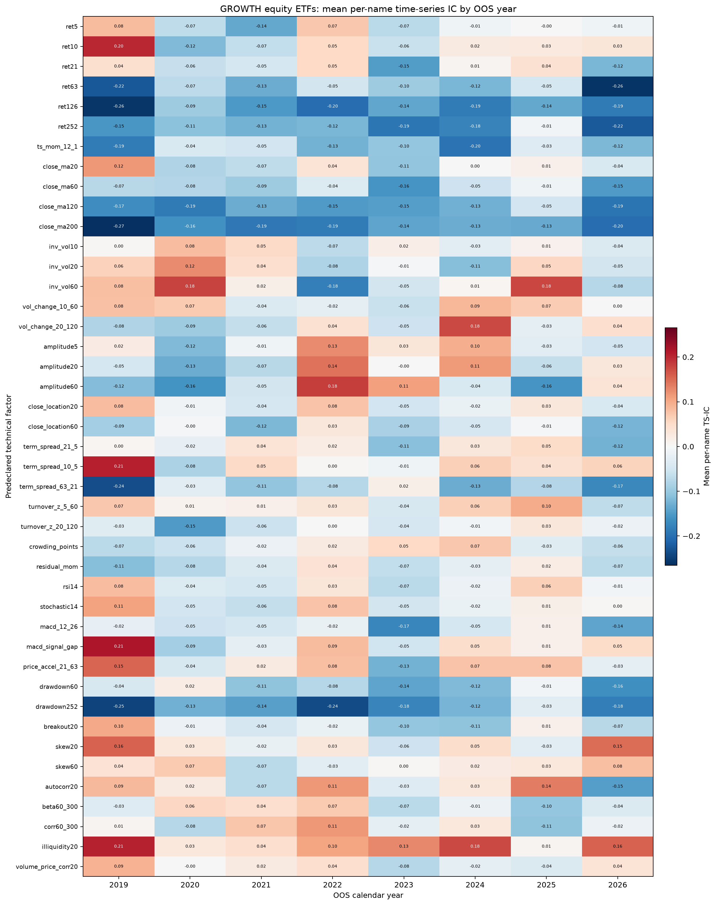

# High-dimensional time-series ETF factor mining

Generated by `research/factor_mine_highdim.py` at 2026-08-22 02:31 UTC.

## Frozen protocol

- Main universe: the 17 equity ETFs in `ptrade_rmdc_etf.GROWTH`. Separate test: `510300.SS`, `159915.SZ`, `513100.SS`, `518880.SS`; results are never pooled.
- Signals use Friday or the final available bar in each ISO week. Labels are next-week close returns only; missing whole weeks are not bridged.
- For each calendar-year test slice and each ETF, TS-IC is Pearson corr(factor at T, return T to T+1 week), with at least 12 observations. Reported IC is the mean across names and IC IR is mean/std across names.
- Expanding boundary: a training row is eligible only when its next-week label is strictly before January 1 of test year Y. Factor formulas and the factor count N=43 were fixed before examining this run.
- Combo membership for Y uses only completed prior-OOS main-universe labels and requires pooled IR > 0.30. Scores are equal-weight causal within-name expanding percentile ranks. The threshold is never relaxed.
- 2026-07 has no special role in definitions, selection, or reporting.

The DSR-style score subtracts the expected best null IC IR among N independent Gaussian trials from observed IC IR. Bonferroni p-values multiply a two-sided normal approximation by N. ETF correlations make the independence assumption optimistic, so the separate universe is also required before any live recommendation.

## Pass/fail and live recommendation

- Main raw-IR passers: `ret10`, `ret21`, `close_ma20`, `inv_vol60`, `vol_change_10_60`, `close_location20`, `term_spread_21_5`, `term_spread_10_5`, `turnover_z_5_60`, `rsi14`, `macd_signal_gap`, `price_accel_21_63`, `skew20`, `autocorr20`, `corr60_300`, `illiquidity20`, `volume_price_corr20`.
- Separate four-asset raw-IR passers: `ret10`, `ret21`, `ret252`, `ts_mom_12_1`, `close_ma20`, `close_ma60`, `inv_vol10`, `inv_vol20`, `inv_vol60`, `close_location20`, `close_location60`, `term_spread_21_5`, `term_spread_10_5`, `rsi14`, `stochastic14`, `macd_12_26`, `price_accel_21_63`, `drawdown60`, `drawdown252`, `skew20`, `skew60`, `autocorr20`, `volume_price_corr20`.
- No factor cleared the raw IR threshold plus the separate-universe and deflated-score gates. No mined factor is approved for live use.

## Walk-forward boundary and combo audit

| Test year | Last train label | Test start | Test end | Test weeks | Factors selected before year |
| --- | --- | --- | --- | --- | --- |
| 2019 | 2018-12-28 | 2019-01-04 | 2019-12-27 | 50 | None |
| 2020 | 2019-12-27 | 2020-01-03 | 2020-12-31 | 51 | ret5, ret10, close_ma20, inv_vol20, inv_vol60, vol_change_10_60, close_location20, term_spread_10_5, turnover_z_5_60, rsi14, stochastic14, macd_signal_gap, price_accel_21_63, breakout20, skew20, skew60, autocorr20, illiquidity20, volume_price_corr20 |
| 2021 | 2020-12-31 | 2021-01-08 | 2021-12-31 | 52 | inv_vol10, inv_vol20, inv_vol60, vol_change_10_60, close_location20, turnover_z_5_60, price_accel_21_63, drawdown60, breakout20, skew20, skew60, illiquidity20, volume_price_corr20 |
| 2022 | 2021-12-31 | 2022-01-07 | 2022-12-30 | 48 | inv_vol10, inv_vol20, inv_vol60, close_location20, term_spread_21_5, term_spread_10_5, turnover_z_5_60, price_accel_21_63, breakout20, beta60_300, corr60_300, illiquidity20, volume_price_corr20 |
| 2023 | 2022-12-30 | 2023-01-06 | 2023-12-29 | 48 | ret21, close_ma20, inv_vol20, close_location20, term_spread_21_5, term_spread_10_5, turnover_z_5_60, rsi14, stochastic14, macd_12_26, macd_signal_gap, price_accel_21_63, breakout20, autocorr20, beta60_300, corr60_300, illiquidity20, volume_price_corr20 |
| 2024 | 2023-12-29 | 2024-01-05 | 2024-12-27 | 50 | ret21, close_location20, term_spread_21_5, term_spread_10_5, turnover_z_5_60, rsi14, stochastic14, macd_signal_gap, price_accel_21_63, beta60_300, corr60_300, illiquidity20, volume_price_corr20 |
| 2025 | 2024-12-27 | 2025-01-03 | 2025-12-31 | 53 | ret10, ret21, vol_change_10_60, vol_change_20_120, amplitude5, amplitude20, close_location20, term_spread_21_5, term_spread_10_5, turnover_z_5_60, macd_signal_gap, price_accel_21_63, corr60_300, illiquidity20, volume_price_corr20 |
| 2026 | 2025-12-31 | 2026-01-09 | 2026-08-14 | 30 | ret10, ret21, close_ma20, inv_vol60, vol_change_10_60, amplitude5, close_location20, term_spread_21_5, term_spread_10_5, turnover_z_5_60, rsi14, macd_12_26, macd_signal_gap, price_accel_21_63, autocorr20, corr60_300, illiquidity20, volume_price_corr20 |

## Main GROWTH universe: pooled OOS TS-IC

| Factor | Names | Mean IC | IC IR | Positive names | N-test hurdle | Deflated score | Bonferroni p | IR>0.30 |
| --- | --- | --- | --- | --- | --- | --- | --- | --- |
| illiquidity20 | 17 | 0.053 | 1.039 | 76.5% | 0.538 | 0.501 | 0.0008 | YES |
| term_spread_10_5 | 17 | 0.046 | 0.773 | 76.5% | 0.538 | 0.235 | 0.0621 | YES |
| price_accel_21_63 | 17 | 0.052 | 0.713 | 76.5% | 0.538 | 0.176 | 0.1404 | YES |
| vol_change_10_60 | 17 | 0.027 | 0.710 | 70.6% | 0.538 | 0.173 | 0.1461 | YES |
| turnover_z_5_60 | 17 | 0.032 | 0.641 | 70.6% | 0.538 | 0.103 | 0.3551 | YES |
| skew20 | 17 | 0.025 | 0.614 | 82.4% | 0.538 | 0.076 | 0.4911 | YES |
| term_spread_21_5 | 17 | 0.032 | 0.613 | 70.6% | 0.538 | 0.075 | 0.4959 | YES |
| volume_price_corr20 | 17 | 0.029 | 0.590 | 64.7% | 0.538 | 0.052 | 0.6477 | YES |
| corr60_300 | 17 | 0.029 | 0.582 | 82.4% | 0.538 | 0.044 | 0.7089 | YES |
| macd_signal_gap | 17 | 0.030 | 0.524 | 70.6% | 0.538 | -0.014 | 1.0000 | YES |
| inv_vol60 | 17 | 0.014 | 0.477 | 70.6% | 0.538 | -0.061 | 1.0000 | YES |
| ret10 | 17 | 0.025 | 0.444 | 64.7% | 0.538 | -0.094 | 1.0000 | YES |
| close_location20 | 17 | 0.022 | 0.416 | 70.6% | 0.538 | -0.122 | 1.0000 | YES |
| autocorr20 | 17 | 0.023 | 0.403 | 70.6% | 0.538 | -0.134 | 1.0000 | YES |
| ret21 | 17 | 0.022 | 0.382 | 58.8% | 0.538 | -0.156 | 1.0000 | YES |
| rsi14 | 17 | 0.022 | 0.351 | 70.6% | 0.538 | -0.187 | 1.0000 | YES |
| close_ma20 | 17 | 0.017 | 0.310 | 64.7% | 0.538 | -0.228 | 1.0000 | YES |
| skew60 | 17 | 0.009 | 0.278 | 58.8% | 0.538 | -0.260 | 1.0000 | no |
| stochastic14 | 17 | 0.014 | 0.258 | 64.7% | 0.538 | -0.280 | 1.0000 | no |
| macd_12_26 | 17 | 0.008 | 0.229 | 47.1% | 0.538 | -0.308 | 1.0000 | no |
| amplitude5 | 17 | 0.009 | 0.195 | 64.7% | 0.538 | -0.343 | 1.0000 | no |
| vol_change_20_120 | 17 | 0.006 | 0.171 | 58.8% | 0.538 | -0.367 | 1.0000 | no |
| close_location60 | 17 | -0.001 | -0.014 | 47.1% | 0.538 | -0.552 | 1.0000 | no |
| inv_vol10 | 17 | -0.001 | -0.029 | 58.8% | 0.538 | -0.567 | 1.0000 | no |
| breakout20 | 17 | -0.002 | -0.041 | 41.2% | 0.538 | -0.579 | 1.0000 | no |
| beta60_300 | 17 | -0.002 | -0.048 | 52.9% | 0.538 | -0.586 | 1.0000 | no |
| inv_vol20 | 17 | -0.002 | -0.067 | 52.9% | 0.538 | -0.605 | 1.0000 | no |
| amplitude20 | 17 | -0.004 | -0.093 | 41.2% | 0.538 | -0.631 | 1.0000 | no |
| ret5 | 17 | -0.006 | -0.118 | 41.2% | 0.538 | -0.655 | 1.0000 | no |
| close_ma60 | 17 | -0.005 | -0.120 | 47.1% | 0.538 | -0.658 | 1.0000 | no |
| drawdown60 | 17 | -0.008 | -0.254 | 52.9% | 0.538 | -0.792 | 1.0000 | no |
| residual_mom | 15 | -0.010 | -0.274 | 40.0% | 0.573 | -0.846 | 1.0000 | no |
| crowding_points | 17 | -0.015 | -0.295 | 35.3% | 0.538 | -0.833 | 1.0000 | no |
| turnover_z_20_120 | 17 | -0.020 | -0.373 | 35.3% | 0.538 | -0.911 | 1.0000 | no |
| ret252 | 17 | -0.021 | -0.398 | 29.4% | 0.538 | -0.936 | 1.0000 | no |
| drawdown252 | 17 | -0.017 | -0.411 | 47.1% | 0.538 | -0.949 | 1.0000 | no |
| ts_mom_12_1 | 17 | -0.025 | -0.444 | 35.3% | 0.538 | -0.982 | 1.0000 | no |
| close_ma200 | 17 | -0.030 | -0.745 | 17.6% | 0.538 | -1.283 | 0.0912 | no |
| amplitude60 | 17 | -0.030 | -0.794 | 29.4% | 0.538 | -1.332 | 0.0456 | no |
| close_ma120 | 17 | -0.029 | -0.813 | 23.5% | 0.538 | -1.351 | 0.0346 | no |
| ret126 | 17 | -0.034 | -0.864 | 17.6% | 0.538 | -1.401 | 0.0159 | no |
| term_spread_63_21 | 17 | -0.062 | -1.009 | 11.8% | 0.538 | -1.547 | 0.0014 | no |
| ret63 | 17 | -0.041 | -1.042 | 17.6% | 0.538 | -1.580 | 0.0008 | no |

## Separate four-asset test: pooled OOS TS-IC

| Factor | Names | Mean IC | IC IR | Positive names | N-test hurdle | Deflated score | Bonferroni p | IR>0.30 |
| --- | --- | --- | --- | --- | --- | --- | --- | --- |
| close_location60 | 4 | 0.042 | 1.223 | 75.0% | 1.109 | 0.114 | 0.6225 | YES |
| volume_price_corr20 | 4 | 0.063 | 1.075 | 100.0% | 1.109 | -0.034 | 1.0000 | YES |
| close_location20 | 4 | 0.048 | 1.028 | 75.0% | 1.109 | -0.081 | 1.0000 | YES |
| term_spread_10_5 | 4 | 0.036 | 0.862 | 75.0% | 1.109 | -0.247 | 1.0000 | YES |
| price_accel_21_63 | 4 | 0.056 | 0.852 | 75.0% | 1.109 | -0.257 | 1.0000 | YES |
| stochastic14 | 4 | 0.037 | 0.787 | 75.0% | 1.109 | -0.322 | 1.0000 | YES |
| term_spread_21_5 | 4 | 0.038 | 0.764 | 75.0% | 1.109 | -0.345 | 1.0000 | YES |
| rsi14 | 4 | 0.045 | 0.711 | 75.0% | 1.109 | -0.398 | 1.0000 | YES |
| skew20 | 4 | 0.034 | 0.621 | 75.0% | 1.109 | -0.488 | 1.0000 | YES |
| ret21 | 4 | 0.033 | 0.547 | 50.0% | 1.109 | -0.562 | 1.0000 | YES |
| skew60 | 4 | 0.043 | 0.540 | 50.0% | 1.109 | -0.569 | 1.0000 | YES |
| ret10 | 4 | 0.026 | 0.522 | 50.0% | 1.109 | -0.587 | 1.0000 | YES |
| inv_vol60 | 4 | 0.025 | 0.518 | 50.0% | 1.109 | -0.591 | 1.0000 | YES |
| ret252 | 4 | 0.018 | 0.507 | 75.0% | 1.109 | -0.602 | 1.0000 | YES |
| inv_vol10 | 4 | 0.022 | 0.503 | 75.0% | 1.109 | -0.606 | 1.0000 | YES |
| ts_mom_12_1 | 4 | 0.011 | 0.452 | 75.0% | 1.109 | -0.657 | 1.0000 | YES |
| autocorr20 | 4 | 0.021 | 0.447 | 50.0% | 1.109 | -0.662 | 1.0000 | YES |
| drawdown252 | 4 | 0.024 | 0.444 | 75.0% | 1.109 | -0.665 | 1.0000 | YES |
| drawdown60 | 4 | 0.025 | 0.441 | 75.0% | 1.109 | -0.668 | 1.0000 | YES |
| macd_12_26 | 4 | 0.019 | 0.419 | 50.0% | 1.109 | -0.690 | 1.0000 | YES |
| close_ma60 | 4 | 0.013 | 0.397 | 50.0% | 1.109 | -0.712 | 1.0000 | YES |
| inv_vol20 | 4 | 0.021 | 0.382 | 50.0% | 1.109 | -0.727 | 1.0000 | YES |
| close_ma20 | 4 | 0.024 | 0.380 | 50.0% | 1.109 | -0.729 | 1.0000 | YES |
| breakout20 | 4 | 0.014 | 0.221 | 75.0% | 1.109 | -0.888 | 1.0000 | no |
| vol_change_10_60 | 4 | 0.008 | 0.202 | 50.0% | 1.109 | -0.907 | 1.0000 | no |
| macd_signal_gap | 4 | 0.008 | 0.101 | 50.0% | 1.109 | -1.008 | 1.0000 | no |
| turnover_z_5_60 | 4 | 0.005 | 0.098 | 50.0% | 1.109 | -1.011 | 1.0000 | no |
| ret5 | 4 | 0.003 | 0.062 | 50.0% | 1.109 | -1.047 | 1.0000 | no |
| illiquidity20 | 4 | 0.002 | 0.031 | 50.0% | 1.109 | -1.078 | 1.0000 | no |
| amplitude5 | 4 | -0.009 | -0.192 | 25.0% | 1.109 | -1.301 | 1.0000 | no |
| close_ma120 | 4 | -0.011 | -0.261 | 25.0% | 1.109 | -1.369 | 1.0000 | no |
| close_ma200 | 4 | -0.009 | -0.288 | 25.0% | 1.109 | -1.397 | 1.0000 | no |
| amplitude20 | 4 | -0.011 | -0.355 | 50.0% | 1.109 | -1.464 | 1.0000 | no |
| corr60_300 | 4 | -0.021 | -0.457 | 50.0% | 1.109 | -1.566 | 1.0000 | no |
| amplitude60 | 4 | -0.028 | -0.585 | 25.0% | 1.109 | -1.694 | 1.0000 | no |
| vol_change_20_120 | 4 | -0.029 | -0.618 | 25.0% | 1.109 | -1.727 | 1.0000 | no |
| ret63 | 4 | -0.026 | -0.942 | 25.0% | 1.109 | -2.051 | 1.0000 | no |
| ret126 | 4 | -0.026 | -1.036 | 25.0% | 1.109 | -2.145 | 1.0000 | no |
| beta60_300 | 4 | -0.055 | -1.148 | 25.0% | 1.109 | -2.257 | 0.9335 | no |
| residual_mom | 3 | -0.016 | -1.249 | 0.0% | 1.281 | -2.530 | 1.0000 | no |
| term_spread_63_21 | 4 | -0.054 | -1.273 | 0.0% | 1.109 | -2.382 | 0.4695 | no |
| crowding_points | 4 | -0.079 | -1.386 | 0.0% | 1.109 | -2.495 | 0.2401 | no |
| turnover_z_20_120 | 4 | -0.047 | -1.421 | 0.0% | 1.109 | -2.530 | 0.1931 | no |

With only four names, cross-name IR is unstable and the N-test null hurdle is deliberately severe. This test is confirmatory, not another source of factor selection.

## Strictly lagged main-universe combo

| Year | Prior-OOS factors | Names | Mean IC | IC IR |
| --- | --- | --- | --- | --- |
| 2019 | None | 0 | N/A | N/A |
| 2020 | ret5, ret10, close_ma20, inv_vol20, inv_vol60, vol_change_10_60, close_location20, term_spread_10_5, turnover_z_5_60, rsi14, stochastic14, macd_signal_gap, price_accel_21_63, breakout20, skew20, skew60, autocorr20, illiquidity20, volume_price_corr20 | 15 | -0.016 | -0.124 |
| 2021 | inv_vol10, inv_vol20, inv_vol60, vol_change_10_60, close_location20, turnover_z_5_60, price_accel_21_63, drawdown60, breakout20, skew20, skew60, illiquidity20, volume_price_corr20 | 17 | -0.035 | -0.256 |
| 2022 | inv_vol10, inv_vol20, inv_vol60, close_location20, term_spread_21_5, term_spread_10_5, turnover_z_5_60, price_accel_21_63, breakout20, beta60_300, corr60_300, illiquidity20, volume_price_corr20 | 17 | 0.058 | 0.588 |
| 2023 | ret21, close_ma20, inv_vol20, close_location20, term_spread_21_5, term_spread_10_5, turnover_z_5_60, rsi14, stochastic14, macd_12_26, macd_signal_gap, price_accel_21_63, breakout20, autocorr20, beta60_300, corr60_300, illiquidity20, volume_price_corr20 | 17 | -0.095 | -0.901 |
| 2024 | ret21, close_location20, term_spread_21_5, term_spread_10_5, turnover_z_5_60, rsi14, stochastic14, macd_signal_gap, price_accel_21_63, beta60_300, corr60_300, illiquidity20, volume_price_corr20 | 17 | 0.039 | 0.341 |
| 2025 | ret10, ret21, vol_change_10_60, vol_change_20_120, amplitude5, amplitude20, close_location20, term_spread_21_5, term_spread_10_5, turnover_z_5_60, macd_signal_gap, price_accel_21_63, corr60_300, illiquidity20, volume_price_corr20 | 17 | 0.041 | 0.403 |
| 2026 | ret10, ret21, close_ma20, inv_vol60, vol_change_10_60, amplitude5, close_location20, term_spread_21_5, term_spread_10_5, turnover_z_5_60, rsi14, macd_12_26, macd_signal_gap, price_accel_21_63, autocorr20, corr60_300, illiquidity20, volume_price_corr20 | 17 | -0.048 | -0.359 |
| Pooled | Year-specific | 17 | 0.020 | 0.322 |

## A priori factor inventory

| # | Factor | Definition |
| --- | --- | --- |
| 1 | ret5 | 5-day close return |
| 2 | ret10 | 10-day close return |
| 3 | ret21 | 21-day close return |
| 4 | ret63 | 63-day close return |
| 5 | ret126 | 126-day close return |
| 6 | ret252 | 252-day close return |
| 7 | ts_mom_12_1 | close(T-21)/close(T-252)-1; 126d/5d fallback |
| 8 | close_ma20 | close / 20-day moving average |
| 9 | close_ma60 | close / 60-day moving average |
| 10 | close_ma120 | close / 120-day moving average |
| 11 | close_ma200 | close / 200-day moving average |
| 12 | inv_vol10 | inverse 10-day annualized log-return volatility |
| 13 | inv_vol20 | inverse 20-day annualized log-return volatility |
| 14 | inv_vol60 | inverse 60-day annualized log-return volatility |
| 15 | vol_change_10_60 | 10-day volatility / 60-day volatility - 1 |
| 16 | vol_change_20_120 | 20-day volatility / 120-day volatility - 1 |
| 17 | amplitude5 | 5-day mean (high-low)/previous close |
| 18 | amplitude20 | 20-day mean (high-low)/previous close |
| 19 | amplitude60 | 60-day mean (high-low)/previous close |
| 20 | close_location20 | close location in trailing 20-day high-low range |
| 21 | close_location60 | close location in trailing 60-day high-low range |
| 22 | term_spread_21_5 | 21-day return minus 5-day return |
| 23 | term_spread_10_5 | 10-day return minus 5-day return |
| 24 | term_spread_63_21 | 63-day return minus 21-day return |
| 25 | turnover_z_5_60 | 5d-vs-60d log-amount z-score |
| 26 | turnover_z_20_120 | 20d-vs-120d log-amount z-score |
| 27 | crowding_points | raw live 0-4 crowding score (negative control) |
| 28 | residual_mom | 120d market+size OLS residual score (negative control) |
| 29 | rsi14 | 14-day RSI scaled to [0,1] |
| 30 | stochastic14 | close location in trailing 14-day range |
| 31 | macd_12_26 | (EMA12-EMA26)/close |
| 32 | macd_signal_gap | MACD minus its 9-day EMA, divided by close |
| 33 | price_accel_21_63 | 21-day return minus one-third of 63-day return |
| 34 | drawdown60 | close / trailing 60-day high - 1 |
| 35 | drawdown252 | close / trailing 252-day high - 1 |
| 36 | breakout20 | close / trailing 20-day high - 1 |
| 37 | skew20 | 20-day daily log-return skew |
| 38 | skew60 | 60-day daily log-return skew |
| 39 | autocorr20 | 20-day lag-1 daily log-return correlation |
| 40 | beta60_300 | 60-day beta to 510300 |
| 41 | corr60_300 | 60-day daily-return correlation to 510300 |
| 42 | illiquidity20 | 20-day mean abs(return)/(amount/1e8) |
| 43 | volume_price_corr20 | 20-day corr(log-volume change, log return) |

## Limitations

- The current cache has survivorship bias: later ETFs enter after inception, while historical delisted funds may be absent.
- These are signal diagnostics, not a portfolio backtest. Costs, turnover, capacity, and execution are not modeled.
- 2026 is partial through the cache boundary; the unlabeled final week is excluded automatically.
