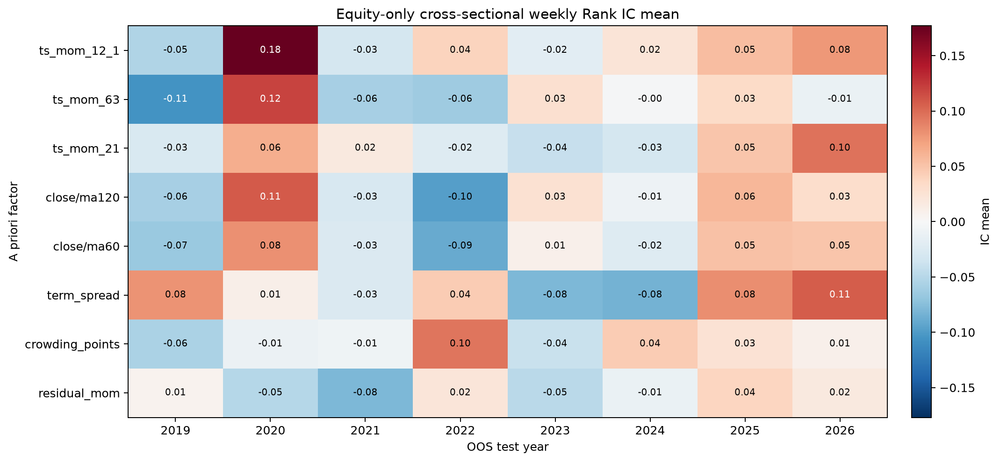
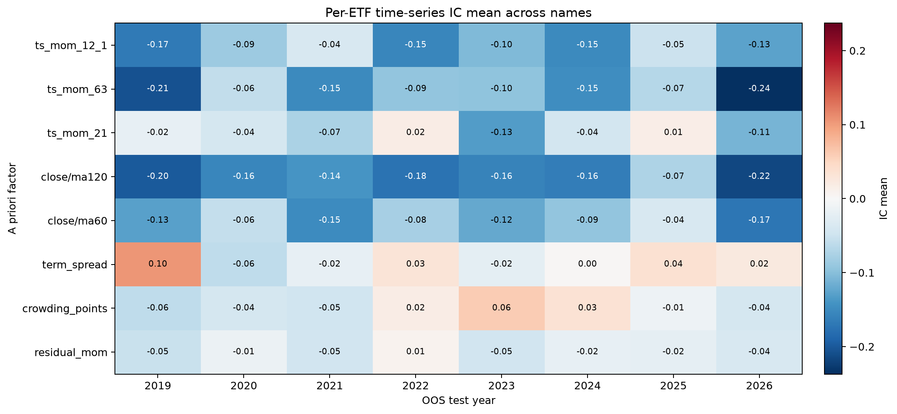

# ETF factor expanding-window walk-forward

Generated by `research/factor_walkforward.py` at 2026-08-22 02:44 UTC.

## Protocol and leakage controls

- Data: 36 parquet files; 35 ETFs after excluding the standalone `000300.SS` index; 17 equity ETFs in the live `GROWTH` sleeve; weekly signal coverage 2016-05-06 through 2026-08-21.
- Signal row: Friday or the last available bar of each ISO week. Label: close-to-close return from that row to the next ISO week only. Missing whole weeks are not bridged.
- Equity-CS IC: weekly cross-sectional Spearman correlation using only the 17-name `GROWTH` equity sleeve, requiring at least 5 names. IC IR is mean weekly IC divided by its weekly standard deviation.
- TS-IC: within each ETF, Pearson corr(factor at T, next-week return), requiring at least 12 weeks; the reported IC is the mean across ETF names and its IR uses dispersion across names.
- Walk-forward: for test year Y, training observations must have their next-week label strictly before January 1 of Y. Fixed factor formulas have no cross-sectional fitted coefficients. The residual factor's 120-day time-series OLS ends five trading returns before each signal.
- Combo: equal-weight average of complete equity cross-sectional percentile ranks. A factor enters only when its pooled equity-CS IC IR across already completed OOS years exceeds 0.30. TS-IC is not mixed into this selector, and current-year labels are appended only after membership is fixed.
- No month or subperiod, including 2026-07, receives special tuning or selection treatment.

A priori factors: `ts_mom_12_1` is close(T-21)/close(T-252)-1, falling back to close(T-5)/close(T-126)-1 until 252 bars exist; `term_spread` is the 10-day return minus the 5-day return. `crowding_points` is the raw live 0-4 score and `residual_mom` is the existing 120-day OLS residual score; both are retained as predeclared negative controls. Common-series gold/bond spreads are excluded because subtracting one value from every name cannot change a cross-sectional rank.

## Walk-forward boundary audit

| Test year | Train signal start | Last train label | Train weeks | Test signal start | Test signal end | Labeled test weeks |
| --- | --- | --- | --- | --- | --- | --- |
| 2019 | 2016-05-06 | 2018-12-28 | 132 | 2019-01-04 | 2019-12-27 | 50 |
| 2020 | 2016-05-06 | 2019-12-27 | 182 | 2020-01-03 | 2020-12-31 | 51 |
| 2021 | 2016-05-06 | 2020-12-31 | 233 | 2021-01-08 | 2021-12-31 | 52 |
| 2022 | 2016-05-06 | 2021-12-31 | 285 | 2022-01-07 | 2022-12-30 | 48 |
| 2023 | 2016-05-06 | 2022-12-30 | 333 | 2023-01-06 | 2023-12-29 | 48 |
| 2024 | 2016-05-06 | 2023-12-29 | 381 | 2024-01-05 | 2024-12-27 | 50 |
| 2025 | 2016-05-06 | 2024-12-27 | 431 | 2025-01-03 | 2025-12-31 | 53 |
| 2026 | 2016-05-06 | 2025-12-31 | 484 | 2026-01-09 | 2026-08-14 | 30 |

The first OOS year is 2019. Its combo is deliberately absent because there is no prior OOS evidence available for factor selection.

## Equity-only cross-sectional IC

### Pooled OOS results (2019-2026)

| Factor | Weeks | IC mean | IC IR | Hit rate |
| --- | --- | --- | --- | --- |
| ts_mom_12_1 | 382 | 0.032 | 0.077 | 51.3% |
| term_spread | 382 | 0.013 | 0.033 | 55.0% |
| ts_mom_21 | 382 | 0.010 | 0.024 | 51.0% |
| crowding_points | 376 | 0.007 | 0.023 | 50.0% |
| close/ma120 | 382 | 0.004 | 0.008 | 50.8% |
| close/ma60 | 382 | -0.004 | -0.009 | 46.6% |
| ts_mom_63 | 382 | -0.007 | -0.017 | 49.7% |
| residual_mom | 382 | -0.015 | -0.039 | 49.5% |

Top pooled equity-CS rows by IC IR: ts_mom_12_1 (IR 0.077), term_spread (IR 0.033), ts_mom_21 (IR 0.024), crowding_points (IR 0.023), close/ma120 (IR 0.008).

### IC mean by test year

| Factor | 2019 | 2020 | 2021 | 2022 | 2023 | 2024 | 2025 | 2026 |
| --- | --- | --- | --- | --- | --- | --- | --- | --- |
| ts_mom_12_1 | -0.053 | 0.177 | -0.031 | 0.040 | -0.019 | 0.022 | 0.055 | 0.077 |
| ts_mom_63 | -0.106 | 0.120 | -0.058 | -0.063 | 0.029 | -0.001 | 0.034 | -0.012 |
| ts_mom_21 | -0.027 | 0.064 | 0.017 | -0.023 | -0.040 | -0.032 | 0.050 | 0.096 |
| close/ma120 | -0.059 | 0.109 | -0.029 | -0.098 | 0.027 | -0.009 | 0.059 | 0.031 |
| close/ma60 | -0.065 | 0.080 | -0.026 | -0.089 | 0.009 | -0.023 | 0.051 | 0.049 |
| term_spread | 0.080 | 0.010 | -0.025 | 0.044 | -0.080 | -0.084 | 0.083 | 0.107 |
| crowding_points | -0.056 | -0.010 | -0.008 | 0.095 | -0.039 | 0.045 | 0.025 | 0.008 |
| residual_mom | 0.007 | -0.050 | -0.079 | 0.021 | -0.048 | -0.011 | 0.039 | 0.018 |

### IC IR by test year

| Factor | 2019 | 2020 | 2021 | 2022 | 2023 | 2024 | 2025 | 2026 |
| --- | --- | --- | --- | --- | --- | --- | --- | --- |
| ts_mom_12_1 | -0.122 | 0.488 | -0.078 | 0.114 | -0.051 | 0.053 | 0.121 | 0.154 |
| ts_mom_63 | -0.223 | 0.351 | -0.146 | -0.156 | 0.079 | -0.004 | 0.078 | -0.027 |
| ts_mom_21 | -0.067 | 0.178 | 0.039 | -0.060 | -0.098 | -0.081 | 0.128 | 0.213 |
| close/ma120 | -0.120 | 0.319 | -0.066 | -0.226 | 0.067 | -0.024 | 0.129 | 0.064 |
| close/ma60 | -0.159 | 0.210 | -0.064 | -0.220 | 0.022 | -0.061 | 0.125 | 0.107 |
| term_spread | 0.214 | 0.027 | -0.066 | 0.115 | -0.190 | -0.246 | 0.195 | 0.283 |
| crowding_points | -0.145 | -0.031 | -0.024 | 0.299 | -0.157 | 0.143 | 0.077 | 0.024 |
| residual_mom | 0.013 | -0.138 | -0.242 | 0.055 | -0.145 | -0.035 | 0.108 | 0.047 |

### Positive-IC hit rate by test year

| Factor | 2019 | 2020 | 2021 | 2022 | 2023 | 2024 | 2025 | 2026 |
| --- | --- | --- | --- | --- | --- | --- | --- | --- |
| ts_mom_12_1 | 46.0% | 66.7% | 44.2% | 47.9% | 47.9% | 50.0% | 52.8% | 56.7% |
| ts_mom_63 | 38.0% | 64.7% | 42.3% | 39.6% | 54.2% | 48.0% | 56.6% | 56.7% |
| ts_mom_21 | 48.0% | 51.0% | 59.6% | 47.9% | 41.7% | 46.0% | 56.6% | 60.0% |
| close/ma120 | 44.0% | 58.8% | 50.0% | 37.5% | 50.0% | 52.0% | 62.3% | 50.0% |
| close/ma60 | 36.0% | 58.8% | 42.3% | 41.7% | 45.8% | 42.0% | 54.7% | 53.3% |
| term_spread | 54.0% | 62.7% | 51.9% | 60.4% | 39.6% | 48.0% | 64.2% | 60.0% |
| crowding_points | 41.7% | 51.0% | 48.1% | 56.2% | 39.6% | 51.1% | 55.8% | 60.0% |
| residual_mom | 44.0% | 43.1% | 46.2% | 60.4% | 41.7% | 48.0% | 58.5% | 56.7% |

## Per-ETF time-series IC

For each ETF and test slice, IC is the Pearson correlation over time between the factor and the strict next-week return. The pooled table recomputes each name's correlation over all OOS weeks rather than averaging annual correlations.

| Factor | ETFs | Mean per-name IC | Cross-name IR | Positive-name rate |
| --- | --- | --- | --- | --- |
| term_spread | 35 | 0.032 | 0.475 | 68.6% |
| ts_mom_21 | 35 | 0.007 | 0.106 | 48.6% |
| residual_mom | 33 | -0.005 | -0.100 | 39.4% |
| crowding_points | 35 | -0.010 | -0.162 | 45.7% |
| ts_mom_12_1 | 35 | -0.015 | -0.328 | 34.3% |
| close/ma60 | 35 | -0.021 | -0.334 | 34.3% |
| close/ma120 | 35 | -0.043 | -0.791 | 20.0% |
| ts_mom_63 | 35 | -0.044 | -0.894 | 17.1% |

Top pooled TS rows by cross-name IR: term_spread (IC 0.032, IR 0.475), ts_mom_21 (IC 0.007, IR 0.106), residual_mom (IC -0.005, IR -0.100), crowding_points (IC -0.010, IR -0.162), ts_mom_12_1 (IC -0.015, IR -0.328).

### Mean per-name TS-IC by test year

| Factor | 2019 | 2020 | 2021 | 2022 | 2023 | 2024 | 2025 | 2026 |
| --- | --- | --- | --- | --- | --- | --- | --- | --- |
| ts_mom_12_1 | -0.168 | -0.087 | -0.038 | -0.154 | -0.104 | -0.151 | -0.051 | -0.127 |
| ts_mom_63 | -0.206 | -0.059 | -0.151 | -0.094 | -0.095 | -0.147 | -0.068 | -0.237 |
| ts_mom_21 | -0.020 | -0.041 | -0.074 | 0.017 | -0.133 | -0.044 | 0.015 | -0.110 |
| close/ma120 | -0.198 | -0.155 | -0.139 | -0.176 | -0.158 | -0.164 | -0.073 | -0.216 |
| close/ma60 | -0.128 | -0.057 | -0.150 | -0.079 | -0.121 | -0.093 | -0.039 | -0.172 |
| term_spread | 0.104 | -0.060 | -0.019 | 0.030 | -0.023 | 0.004 | 0.036 | 0.022 |
| crowding_points | -0.060 | -0.041 | -0.047 | 0.018 | 0.060 | 0.034 | -0.011 | -0.042 |
| residual_mom | -0.053 | -0.014 | -0.046 | 0.008 | -0.045 | -0.019 | -0.021 | -0.039 |

### Cross-name TS-IC IR by test year

| Factor | 2019 | 2020 | 2021 | 2022 | 2023 | 2024 | 2025 | 2026 |
| --- | --- | --- | --- | --- | --- | --- | --- | --- |
| ts_mom_12_1 | -1.314 | -0.635 | -0.277 | -1.091 | -0.850 | -1.302 | -0.382 | -0.985 |
| ts_mom_63 | -1.868 | -0.687 | -1.336 | -1.148 | -0.997 | -2.453 | -0.821 | -2.257 |
| ts_mom_21 | -0.113 | -0.410 | -0.564 | 0.138 | -1.620 | -0.314 | 0.138 | -0.895 |
| close/ma120 | -1.740 | -1.137 | -1.438 | -2.263 | -1.490 | -1.768 | -0.769 | -1.897 |
| close/ma60 | -0.702 | -0.701 | -0.895 | -0.658 | -0.922 | -0.838 | -0.424 | -1.449 |
| term_spread | 0.496 | -0.469 | -0.109 | 0.274 | -0.195 | 0.032 | 0.400 | 0.131 |
| crowding_points | -0.370 | -0.445 | -0.317 | 0.103 | 0.372 | 0.300 | -0.099 | -0.240 |
| residual_mom | -0.447 | -0.085 | -0.371 | 0.091 | -0.379 | -0.139 | -0.144 | -0.317 |

### Positive-name TS-IC rate by test year

| Factor | 2019 | 2020 | 2021 | 2022 | 2023 | 2024 | 2025 | 2026 |
| --- | --- | --- | --- | --- | --- | --- | --- | --- |
| ts_mom_12_1 | 10.0% | 21.4% | 40.6% | 11.8% | 20.6% | 17.1% | 37.1% | 17.1% |
| ts_mom_63 | 0.0% | 17.2% | 8.8% | 8.8% | 20.0% | 0.0% | 22.9% | 2.9% |
| ts_mom_21 | 45.8% | 31.0% | 29.4% | 64.7% | 0.0% | 51.4% | 60.0% | 20.0% |
| close/ma120 | 0.0% | 13.8% | 6.2% | 0.0% | 5.9% | 0.0% | 17.1% | 2.9% |
| close/ma60 | 37.5% | 17.2% | 14.7% | 23.5% | 17.1% | 25.7% | 22.9% | 8.6% |
| term_spread | 60.0% | 27.6% | 41.2% | 47.1% | 51.4% | 51.4% | 71.4% | 62.9% |
| crowding_points | 37.5% | 31.0% | 39.4% | 50.0% | 71.4% | 71.4% | 45.7% | 34.3% |
| residual_mom | 22.2% | 42.3% | 40.0% | 56.2% | 40.6% | 51.5% | 54.5% | 45.5% |

## TSMOM conditional hit rate (equity only)

This is the fraction of positive next-week returns among equity ETF-weeks where `ts_mom_12_1 > 0`. It is diagnostic only and never enters combo selection.

| Year | Weeks with signals | Positive-signal ETF-weeks | Hit rate |
| --- | --- | --- | --- |
| 2019 | 40 | 235 | 54.9% |
| 2020 | 51 | 591 | 59.2% |
| 2021 | 52 | 684 | 52.2% |
| 2022 | 48 | 222 | 36.9% |
| 2023 | 48 | 216 | 38.9% |
| 2024 | 50 | 217 | 39.6% |
| 2025 | 53 | 760 | 59.2% |
| 2026 | 30 | 438 | 48.4% |
| Pooled | 372 | 3363 | 52.0% |

## Strictly lagged OOS combo

| Year | Factors fixed before year | Weeks | IC mean | IC IR | Hit rate |
| --- | --- | --- | --- | --- | --- |
| 2019 | None (first OOS year) | 0 | N/A | N/A | N/A |
| 2020 | None (no prior-OOS IC IR > 0.30) | 0 | N/A | N/A | N/A |
| 2021 | None (no prior-OOS IC IR > 0.30) | 0 | N/A | N/A | N/A |
| 2022 | None (no prior-OOS IC IR > 0.30) | 0 | N/A | N/A | N/A |
| 2023 | None (no prior-OOS IC IR > 0.30) | 0 | N/A | N/A | N/A |
| 2024 | None (no prior-OOS IC IR > 0.30) | 0 | N/A | N/A | N/A |
| 2025 | None (no prior-OOS IC IR > 0.30) | 0 | N/A | N/A | N/A |
| 2026 | None (no prior-OOS IC IR > 0.30) | 0 | N/A | N/A | N/A |
| Pooled | Year-specific, selected before each test year | 0 | N/A | N/A | N/A |

No factor crossed the specified prior-OOS equity-CS IC IR threshold, so the rule produces no combo observations. Forcing a combo or lowering the threshold after seeing these results would violate the predeclared selection protocol.

## Multiple-testing adjustment

There are N=8 predeclared factor tests. For equity-CS, the table reports annualized IC Sharpe (`sqrt(52) * IC IR`), an expected-best null hurdle for N independent Gaussian tests, their difference, and a two-sided normal p-value multiplied by N (Bonferroni).

| Factor | Annualized IC Sharpe | N-test null hurdle | Deflated score | Bonferroni p |
| --- | --- | --- | --- | --- |
| ts_mom_12_1 | 0.556 | 0.538 | 0.017 | 1.0000 |
| term_spread | 0.238 | 0.538 | -0.300 | 1.0000 |
| ts_mom_21 | 0.175 | 0.538 | -0.363 | 1.0000 |
| crowding_points | 0.163 | 0.543 | -0.379 | 1.0000 |
| close/ma120 | 0.061 | 0.538 | -0.478 | 1.0000 |
| close/ma60 | -0.063 | 0.538 | -0.601 | 1.0000 |
| ts_mom_63 | -0.119 | 0.538 | -0.658 | 1.0000 |
| residual_mom | -0.283 | 0.538 | -0.822 | 1.0000 |

For TS-IC, temporal annualization is inappropriate because the observations summarized by the IR are per-name correlations. The same N-test adjustment is therefore shown in raw cross-name IC IR units.

| Factor | Cross-name IC IR | N-test null hurdle | Deflated IR | Bonferroni p |
| --- | --- | --- | --- | --- |
| term_spread | 0.475 | 0.247 | 0.228 | 0.0398 |
| ts_mom_21 | 0.106 | 0.247 | -0.141 | 1.0000 |
| residual_mom | -0.100 | 0.254 | -0.354 | 1.0000 |
| crowding_points | -0.162 | 0.247 | -0.409 | 1.0000 |
| ts_mom_12_1 | -0.328 | 0.247 | -0.574 | 0.4199 |
| close/ma60 | -0.334 | 0.247 | -0.581 | 0.3839 |
| close/ma120 | -0.791 | 0.247 | -1.037 | 0.0000 |
| ts_mom_63 | -0.894 | 0.247 | -1.141 | 0.0000 |

These simple corrections treat weekly ICs or ETF-level ICs as independent for the expected-maximum hurdle, which is only an approximation. Bonferroni remains a conservative family-wise screen under dependence. Neither adjustment removes ETF-universe survivorship bias.

## Interpretation limits

- These are predictive cross-sectional and per-name diagnostics, not a traded portfolio backtest; turnover, costs, capacity, and constraints are not included.
- The cache contains today's known ETF universe. ETFs enter only after their own history begins, but delisted or unavailable historical ETFs may be absent.
- 2026 is a partial year ending at the cache boundary. Its final week has no next-week label and is automatically excluded.
